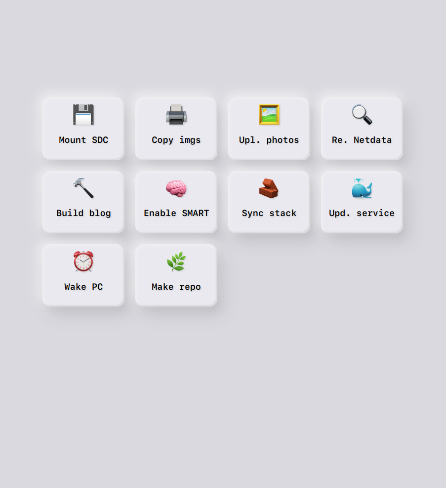

# bubbles

__A skeuomorphic theme for OliveTin__

Use Stylus, or if you can, change the source by copying the content of
`bubbles.css` into the CSS file used by OliveTin. On Arch, this is found in
`/usr/share/webapps/olivetin/webui/style.css`

TODO: fix dark mode

